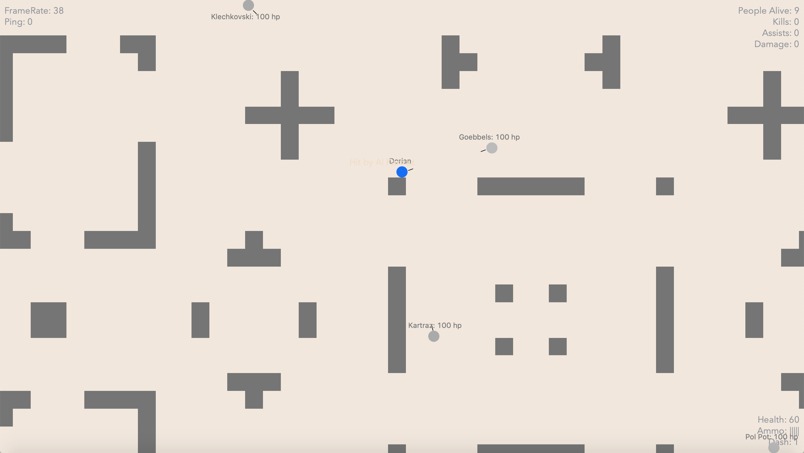

# 2D Python Shooter - 2PQSTD

Other screenshot are available [here](docs/images)

### Installation
- Mac :
	 - `sudo python3 main.py` (in the `client` repository)
- Windows :
    - Execute `main.py` with `python 3`

### Commandes
Keybing can be edit in the game preferences.
Default keybinding is :
- __Se déplacer__  : Z, Q, S, D (or directionnal arrrows)
- __Tirer__ : Left Clic
- __Dash__ : Left Shift
- __Recharger__ : R
- __Help__ : H
- __Melee__ : E

### To-Do
- Health regain
- Add textures
- Server
- Chat In-Game
- Executable file
